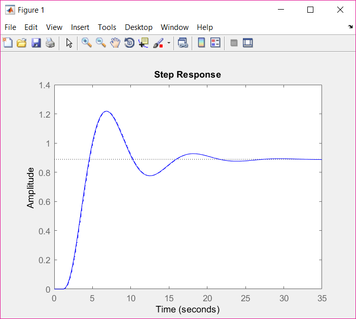
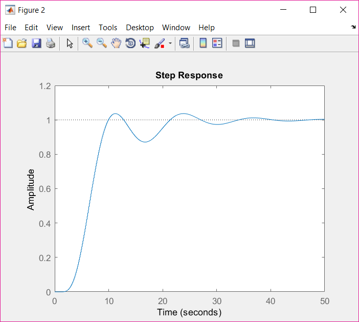

# Control System Design and Analysis

This repository contains the MATLAB code for the design and analysis of a control system. The system is initially analyzed using root locus to identify suitable controller parameters. A controller is then designed to achieve the desired closed-loop response.

## Problem Overview
Consider the system from [System Simulation](https://github.com/sepidehkhakzad/DigitalControl/tree/main/System%20Simulation), discretized with a sampling time of 0.1 seconds:

## Root Locus Analysis
The root locus of the open-loop system is plotted to analyze the system's behavior and identify suitable values for $\zeta$ and $\omega_n$ 

## Controller Design and Closed-Loop Analysis
A controller is designed using pole placement to achieve a desired closed-loop response. 
We want to design the controller in a way that allows us to achieve the ideal intended response without encountering steady-state error.

```
xi = 0.8; % Damping ratio
wn = 5;   % Natural frequency
desired_poles = roots([1, 2*xi*wn, wn^2]);

controller_poles = desired_poles - exp(-Ts*desired_poles);
K = acker(sysd.A, sysd.B, controller_poles);

sys_closed_loop = feedback(sysd*K, 1);
```

## Results
The step response of the open-loop and closed-loop systems is plotted to visualize the impact of the designed controller.

Without controller:

<p align="center">
  
</p>

With controller:

<p align="center">
  
</p>

Root locus and Bode diagram of the system are also drawn.

## How to Run
1. Clone the repository to your local machine.
2. Open MATLAB and navigate to the repository folder.
3. Run the MATLAB scripts corresponding to the problem you want to explore.

## Notes
- Ensure you have MATLAB installed on your machine.
- Adjust parameters such as omega0 as needed in the code.

## Contributors
@sepidehkhakzad
