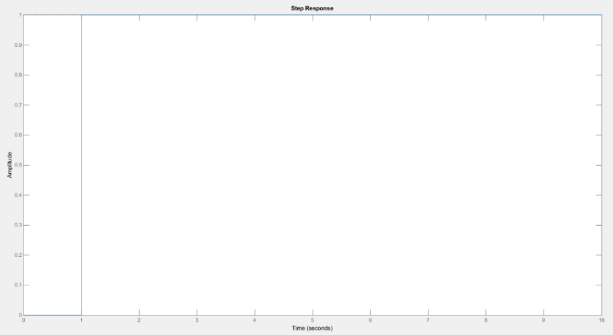
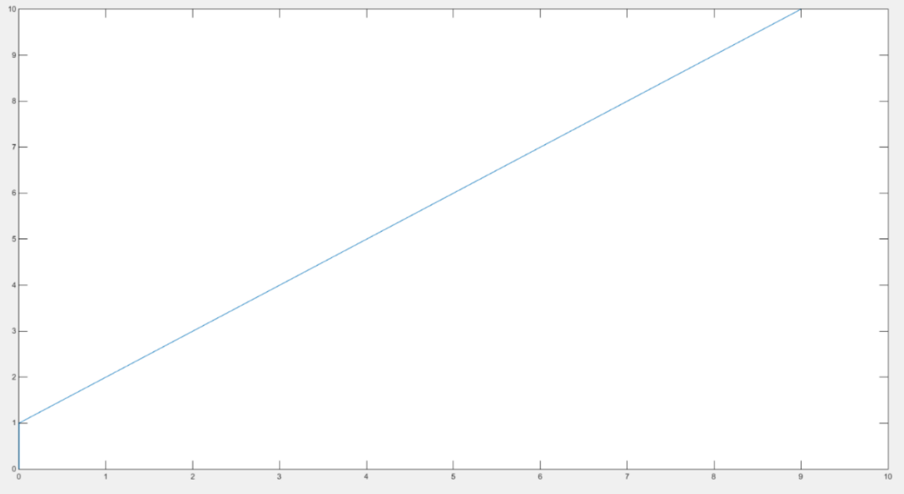
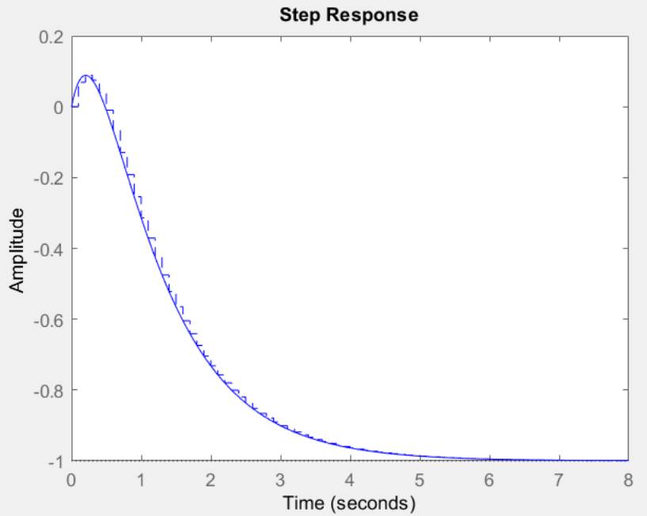
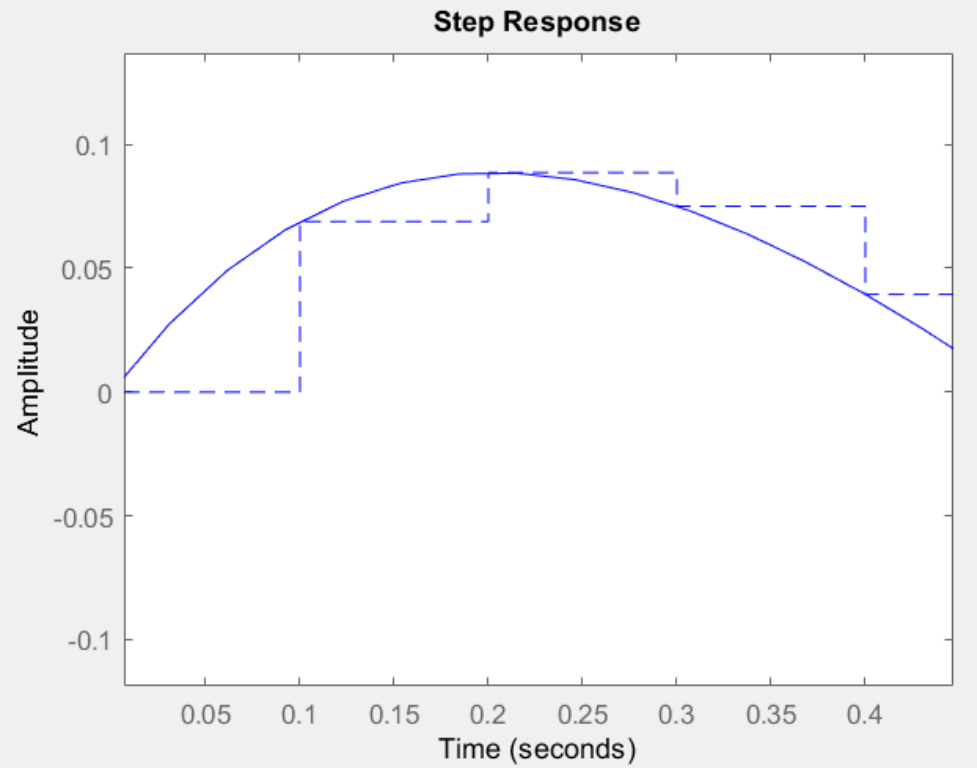

# Digital Control Course

This repository contains MATLAB code files related to the Digital Control course, including solutions to various problems.

## Problem 1: Deadbeat Controller Design and Implementation
We consider the system from [System Simulation](https://github.com/sepidehkhakzad/DigitalControl/tree/main/System%20Simulation) and get the Z-transfer of it:

``````
Ab=[0 1 0 0
-14/15 -3/4 14/15 3/4
0 0 0 1
7/5 9/8 -101/40 -101/40];
Bb=[0
2/3
0
0];
Cb=[0 0 1 0];
Db=0;
[num,den]=ss2tf(Ab,Bb,Cb,Db);
sys=tf(num,den);
P1z = c2d(sys,0.1,'zoh')
``````

We then design a deadbeat controller as follows:

``` 
Tz=1/z;
C1z=Tz/(P1z*(1-Tz));
C1z=minreal(C1z)
step(C1z*P1z/(1+C1z*P1z))
figure
impulse(C1z*P1z/(1+C1z*P1z))
```

After implementing the controller, the output is like this:

<p align="center">
  
</p>

<p align="center">
  
</p>

We observe that after a delay of 1 second, the system has immediately reached the value of 1.

The deadbeat controller ensures that the output signal reaches the desired value after a limited and small number of sampling time intervals.

Advantageously, the speed of this controller is high. However, there are drawbacks, such as the possibility of high overshoot. Additionally, if we discretize a continuous system and then apply it, there may be a risk of ripple in the output.

## Problem 2: Discretization of a Non-Minimum Phase System

This section contains exlanation for MATLAB code for discretizing a non-minimum phase system while preserving its nature. 

### Problem Overview
Consider the non-minimum phase system:
 $$
 G(s)=\frac{s-3}{s^2+4s+3}
 $$


### Discretization with MATLAB
We wrote a MATLAB code to discretize the given system using a zero-order-hold (ZOH) discretization method. The sampling time is chosen so that preserves the nature of the system.
The result is as follows:


<p align="center">
  
</p>

### Observations
By zooming in on the region of the minimum phase effect (initial overshoot), as shown in the figure below, we observe that the impact of this zero diminishes after 0.2 seconds. Therefore, to observe its effect, the sampling time should be less than 0.2 seconds.

<p align="center">
  
</p>

## How to Run
1. Clone the repository to your local machine.
2. Open MATLAB and navigate to the repository folder.
3. Run the MATLAB scripts corresponding to the problem you want to explore.

## Notes
- Ensure you have MATLAB installed on your machine.
- Adjust parameters such as omega0 as needed in the code.

## Contributors
@sepidehkhakzad
