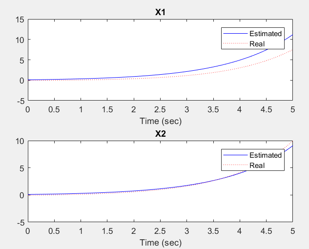

# Kalman Filter with Pole Placement

In the design of a Kalman filter, we have previously focused on pole placement to regulate the convergence speed of the estimation error to zero [Observer Design](https://github.com/sepidehkhakzad/DigitalControl/tree/main/Observer%20Design). However, optimal Kalman filter equations can be utilized to minimize the variance of the estimation error. Consider the following system:

$$
\begin{align*}
\dot{x}(t) &= Fx(t) + w(t) \\
E\{w(t_1)w(t_2)\} &= Q\delta_{t_1, t_2} \quad \delta_{t_1, t_2} = \begin{cases} 0 & t_1 \neq t_2 \\ 1 & t_1 = t_2 \end{cases} \\
m[k] &= Hx[k] + v[k] \\
E\{v(i)v(j)\} &= R\delta_{ij} \quad \delta_{ij} = \begin{cases} 0 & i \neq j \\ 1 & i = j \end{cases}
\end{align*}
$$

where the system is continuous and the measurements are discrete. Here, $w(t)$ is the process noise with covariance matrix $Q$, and $v[k]$ is the measurement noise with covariance matrix $R$. Additionally, $[x]$ represents the process noise covariance matrix, and $[v]$ represents the measurement noise covariance matrix.

The discrete system is represented as:

$$
\begin{align*}
x[k + 1] &= Ax[k] + n[k] \\
E\{n(i)n^T(j)\} &= N\delta_{ij} \quad \delta_{ij} = \begin{cases} 0 & i \neq j \\ 1 & i = j \end{cases}
\end{align*}
$$

where the covariance matrix of the discrete measurement noise is denoted by $N$. The matrices $A$ and $N$ are obtained from the following relations:

$$
\begin{align*}
A &= e^{F\Delta t} \\
N &= \int_0^{\Delta t} e^{F\tau}Qe^{F^T\tau} \,d\tau
\end{align*}
$$

Alternatively, these matrices can be computed using the following more efficient expressions:

$$
\begin{align*}
e^{\mathrm{mpm}\left(\begin{bmatrix} F & Q \\ 0 & F^T \end{bmatrix}\right)} &\equiv \begin{bmatrix} F^2(T) & G^2(T) \\ 0 & F^3(T) \end{bmatrix} \\
A &= F^2(T)^T \\
N &= F^3(T)^T G^2(T)
\end{align*}
$$

Here, $\mathrm{mpm}$ denotes the matrix polynomial multiplication.

## Implementation in MATLAB
The MATLAB code implements this system and the Kalman filter. It includes the definition of system matrices, initial conditions, and the Kalman gain calculation. By calculating the covariance error at each stage, the filter gains are then plotted to visualize their convergence.

  

## Results
The resulting plot demonstrates the convergence of the Kalman filter gains. Additionally, a Simulink model is provided to visualize the system's response with and without the Kalman filter.

  

  

The MATLAB code for simulating the system and visualizing the Kalman filter's performance is provided. It utilizes the Simulink model for the system and includes code snippets for generating Gaussian noise.

## How to Run
1. Clone the repository to your local machine.
2. Open MATLAB and navigate to the repository folder.
3. Run the MATLAB scripts corresponding to the problem you want to explore.

## Notes
- Ensure you have MATLAB installed on your machine.
- Adjust parameters such as omega0 as needed in the code.

## Contributors
@sepidehkhakzad
