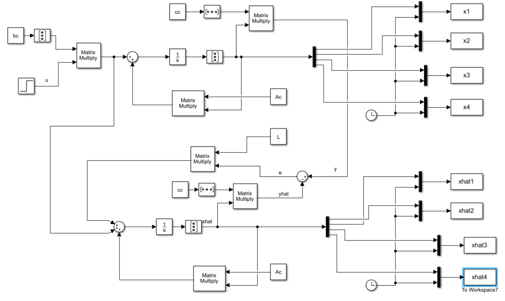

# Observer Design

This repository contains MATLAB code files related to desigining an observer for a particluar descritized system.

## The System
Consider the following system:

  

The parameters are assigned as:

$$
\left\{\begin{array}{ll}
M= 1 & m= 0.1 \\
K= 0.091 & B= 0.0036
\end{array}
$$

After discretization of the model of the system using a suitable sampling time ($ T_s = 0.4 $), we designed an observer by considering the fact that the observer's poles need to be 4 to 10 times faster than the poles of the matrix A.

The simulink drawn is as below:

  

The result is as follows:

  

## How to Run
1. Clone the repository to your local machine.
2. Open MATLAB and navigate to the repository folder.
3. Run the MATLAB scripts corresponding to the problem you want to explore.

## Notes
- Ensure you have MATLAB installed on your machine.
- Adjust parameters such as omega0 as needed in the code.

## Contributors
@sepidehkhakzad
