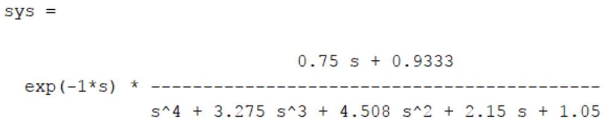
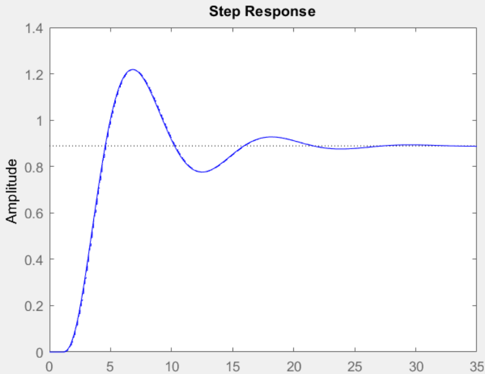

# Digital Control Course

This repository contains MATLAB code files related to the Digital Control course, including solutions to various problems.

## Problem 1: Simulation and Discritization of a System
Consider the following system:

  

The goal is to find the discrete-time model using a suitable sampling time.

## System Equations

We derive the following equations from the governing mechanical relationships.

$$
\begin{aligned}
& m_1 \ddot{x}_1+k_1\left(x_1-x_2\right)+b_1\left(\dot{x}_1-\dot{x}_2\right)=u(t) \\
& m_2 \ddot{x}_2+k_2 x_2+b_2 \dot{x}_2+b_1\left(\dot{x}_2-\dot{x}_1\right)+k_1\left(x_2-x_1\right)=0
\end{aligned}
$$

The parameters are defined as below:

$$
\left\{\begin{array}{ll}
m_1=\frac{3}{2} & m_2=1 \\
b_1=\frac{7}{8} & b_2=\frac{7}{5} \\
k_1=\frac{7}{5} & k_2=\frac{9}{8}
\end{array} \quad \tau=1\right.
$$

After using the above values we have:

$$
\left\{\begin{array}{l}
\frac{3}{2} \bar{x}_1+\frac{7}{3}\left(x_1-x_2\right)+\frac{9}{8}\left(\dot{x}_1-\dot{x}_2\right)=u(t) \\
\vec{x}_2+\frac{9}{3} x_2+\frac{7}{5}\dot{x}_2+\frac{9}{8}\left(\dot{x}_2-\dot{x}_1\right)+\frac{7}{5}\left(x_2-x_1\right)=0
\end{array}\right.
$$

We consider state parameters as: $x_1, \dot{x}_1, x_2, \dot{x}_2$
and we'd have our matrix as follows: 

$$
\begin{aligned}
& \text { A = }\left[\begin{array}{cccc}
0 & 1 & 0 & 0 \\
-\frac{14}{15} & -\frac{3}{4} & +\frac{14}{15} & \frac{3}{4} \\
0 & 0 & 0 & 1 \\
\frac{7}{5} & \frac{2}{8} & -\frac{101}{40} & \frac{-101}{40}
\end{array}\right] \quad b = \left[\begin{array}{c}
0 \\
\frac{2}{3} \\
0 \\
0
\end{array}\right] \\
& C=\left[\begin{array}{llll}
0 & 0 & 1 & 0
\end{array}\right] \\
&
\end{aligned}
$$

Creating the transformation function using the 'tf' command, we introduce a delay as well. Employing the 'c2d' command, we discretize the function with an appropriate sampling frequency (at least twice the frequency of the original function). Subsequently, we illustrated the step response. You can find the Matlab code in Q1.m.

  

  

## Problem 2: System Analysis and State-Space Modeling

This section explains MATLAB code for analyzing and modeling a given transfer function. 

### Problem Overview

Considering the transfer function:

 $$
 H(z)=\frac{z^2+1.5 z+0.45}{z^2+z+0.1}
 $$

we calculate system response to the input:

x = 2*sin(2*n);

We then rewrote the program to implement the canonical state-space representation (canonical form and Markov form). 

The use of canon and ss2zp functions helps in obtaining the canonical and Markov forms, respectively.
The number of state variables in each representation is determined based on the obtained state-space matrices.
You can find the implementation in Q2.m.

## How to Run
1. Clone the repository to your local machine.
2. Open MATLAB and navigate to the repository folder.
3. Run the MATLAB scripts corresponding to the problem you want to explore.

## Notes
- Ensure you have MATLAB installed on your machine.
- Adjust parameters such as omega0 as needed in the code.

## Contributors
@sepidehkhakzad
