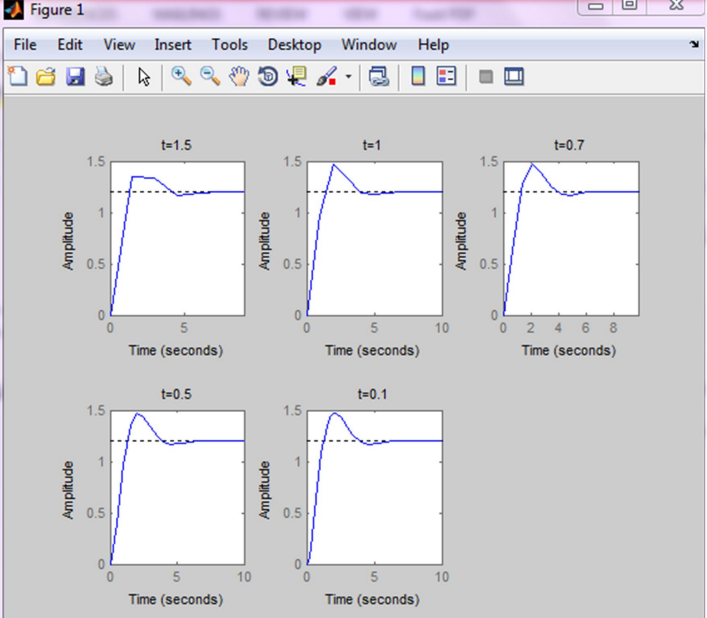
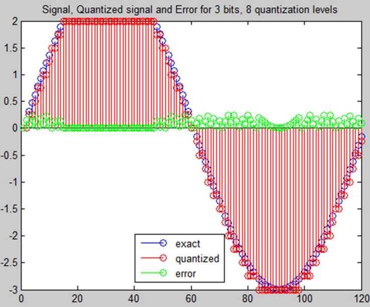

# Digital Control Course

This repository contains MATLAB code files related to the Digital Control course, including solutions to various problems.

## Problem 1: Z-Transform using MATLAB

Q1.m illustrates the calculation of inverse z-Transform of three different functions in Matlab.

## Problem 2: System Analysis and Sampling

We consider the following system:

$$
X(s)=\frac{5 s+6}{s^3+4 s^2+6 s+5}
$$

### Response to Step Input
MATLAB code for the stpo response of the system using different sampling times is provided in Q2.m. The result is as follows:

  

### Observations
Here's how different sampling times can impact the response to a step input:

For a step input, which has a wide frequency spectrum, a higher sampling frequency is generally desirable to capture its rapid changes accurately.

Smaller sampling time (higher sampling frequency) provides better representation of fast-changing dynamics in the system response.
and improved accuracy in capturing high-frequency components.
If the sampling time is too small it's possible that numerical issues (e.g., computational instability) happens

Larger sampling time (lower sampling frequency) leads to slower response time, which may lead to an inaccurate representation of fast system dynamics. Alsso it can cause reduced ability to capture high-frequency components, leading to potential distortion.

In any case, we need to avoid oversampling and undersampling.

### Oversampling (very small sampling time):

Provides more information than necessary, leading to increased computational load without significant improvement in accuracy and
it may cause unnecessary processing overhead.

### Undersampling (very large sampling time):

It may result in aliasing, where high-frequency components are misrepresented as lower frequencies. It can also lead to significant loss of information and accuracy in capturing rapid changes.

### Trade-off:

There's often a trade-off between accuracy and computational efficiency.
Choosing an appropriate sampling time involves considering the system dynamics, the desired level of accuracy, and the computational resources available.

Nyquist Criterion helps choose the best possible sampling time.

### Nyquist Criterion
According to the Nyquist criterion, the sampling time should be 
2 times the natural frequency of the signal to avoid aliasing.

For a step input, which has a wide frequency spectrum, a higher sampling frequency is generally desirable to capture its rapid changes accurately.

## Problem 3: Signal Sampling and Quantization
This section describes a program that takes an arbitrary analog signal, its signal range, sampling frequency, and the number of output bits as input. The program outputs the sample and quantized signal and their corresponding error.

### Program Overview
The MATLAB program is designed to:

- Accept an arbitrary analog signal from the user.
- Take input for the signal range, sampling frequency, and the number of output bits.
- Output the sampled and quantized signal.
- Validate the program using a test case with a user-specified signal, reasonable time vector, and a specified number of output bits.
- Plot the quantization error.

A sample result is as follows:

  

## How to Run
1. Clone the repository to your local machine.
2. Open MATLAB and navigate to the repository folder.
3. Run the MATLAB scripts corresponding to the problem you want to explore.

## Notes
- Ensure you have MATLAB installed on your machine.
- Adjust parameters such as omega0 as needed in the code.

## Contributors
@sepidehkhakzad
